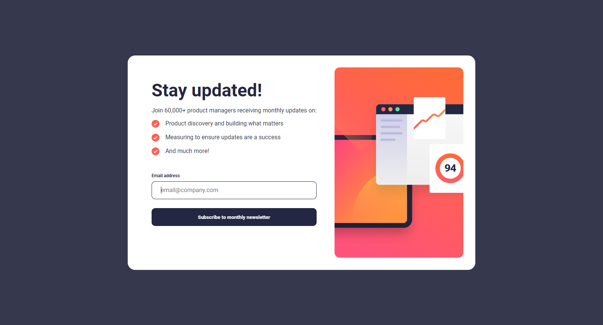
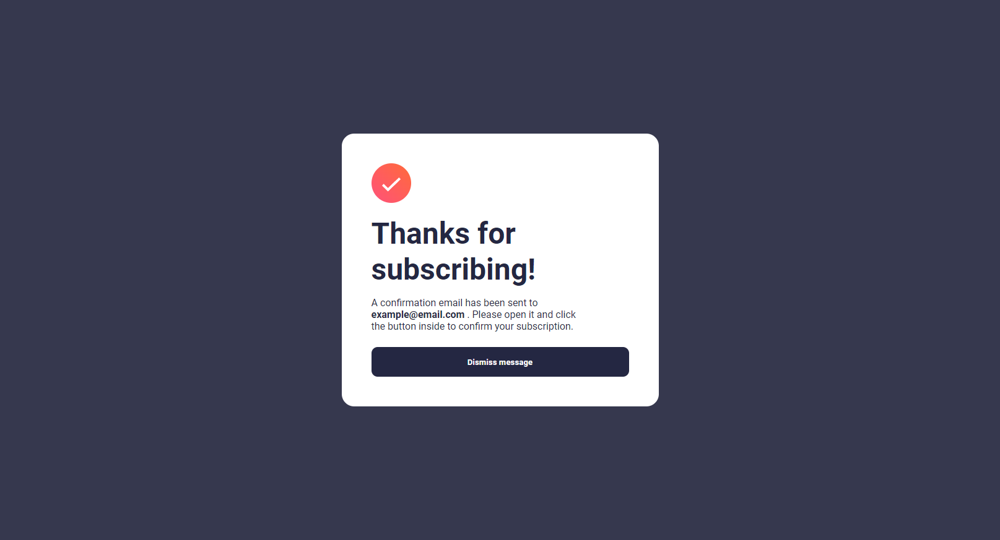

# Newsletter Sign-Up Form with Success Message

## Overview

This project features a newsletter sign-up form designed to engage users and encourage subscription to a monthly newsletter. It is implemented with HTML, CSS, and JavaScript, including input validation to ensure email addresses are correctly formatted. Styled with the 'Roboto' font from Google Fonts for a modern and clean look, the form provides a pleasant user experience, complemented by a success message upon successful subscription.

## Features

- **Responsive Layout:** Adapts to different device screens, ensuring accessibility and user-friendliness.
- **Custom Typography:** Utilizes 'Roboto' font for its readability and contemporary feel.
- **Interactive UI Elements:** The form and success message offer interactive feedback, including a "Dismiss Message" button for user convenience.
- **Email Validation:** JavaScript validates the email input, providing immediate feedback on input errors.
- **Success Message:** Displays a thank you message with additional subscription confirmation details upon successful form submission.

## Screenshots





## Setup

To use this component in your project, follow these steps:

1. **Clone the Repository:**

```bash
git clone https://github.com/Wilmer856/newsletter-signup.git
```

2. **Navigate to the Project Directory:**

```bash
cd newsletter-sign-up-with-success-message-main
```

3. **Open the `index.html` file in a web browser to view the component.**

## Customization

- **Branding:** Replace the placeholder images in the assets/images directory and adjust the style.css file to align with your brand’s visual identity.
- **Content:** Edit the form’s header, descriptions, and the success message to better suit your newsletter’s theme or focus.
- **Functionality:** Enhance or modify the index.js file to integrate with your email marketing platform or to refine the validation logic.

## Dependencies

- Google Fonts: [Roboto](https://fonts.google.com/specimen/Roboto) for typography.
